<table>
  <tr>
    <td width="65%">
      <picture>
        <source media="(prefers-color-scheme: dark)" srcset="isocalendar-dark.svg"/>
        <source media="(prefers-color-scheme: light)" srcset="isocalendar.svg"/>
        
      </picture>
    </td>
    <td width="35%" align="center">
      
    </td>
  </tr>
</table>

  

