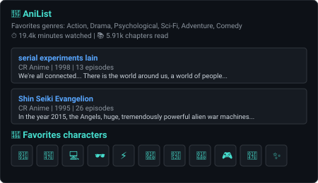
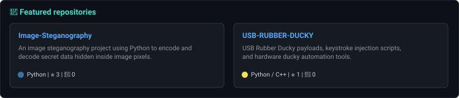
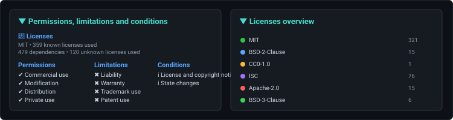

 

## 🥷 About Me

#### LINE BY LINE TYPING Up Green System FOR THIS ABOUT ME TO APPLY

<table>
  <tr>
    <td width="65%" valign="top">
      
    </td>
    <td width="35%" align="center" valign="middle">
      
    </td>
  </tr>
</table>

 

---

<table border="0" width="100%">
  <tr>
    <td width="55%" valign="top">
      
    </td>
    <td width="45%" valign="top">
      
        
      
    </td>
  </tr>
</table>

 

---

  
<b>📁 Featured repositories</b>

   
  

 

  
<b>⚖️ Permissions, limitations and conditions</b>

   
  

 

---

  

