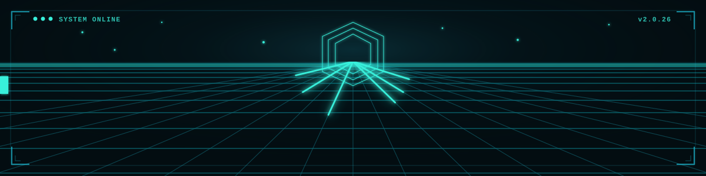

<div align="center">
  
  
  # Hey there! I'm **Sabarish Mettu** 

  [](https://github.com/sabarishmettu)
  [](https://github.com/sabarishmettu)

  <br/>

  > *`Creating Imaginary to Reality`* 🚀

</div>

---

## 🧑‍💻 About Me

```yaml
name: Sabarish Mettu
role: Developer & Creator
location: India (UTC +05:30)
interests:
  - Building innovative tools & automations
  - Cybersecurity & steganography
  - Game development
  - Web development
motto: "Turning imagination into working code"
```

---

## ⚡ Tech Stack

<div align="center">

  
  
  
  
  
  
  
  
  
  

</div>

---

## 🔥 Featured Projects

<div align="center">
  <a href="https://github.com/sabarishmettu/Image-Steganography">
    
  </a>
  <a href="https://github.com/sabarishmettu/USB-RUBBER-DUCKY">
    
  </a>
  <a href="https://github.com/sabarishmettu/Flappy-bird-game">
    
  </a>
  <a href="https://github.com/sabarishmettu/AutoTyper">
    
  </a>
</div>

---

## 📊 GitHub Stats

<div align="center">
  
  &nbsp;&nbsp;&nbsp;
  
</div>

<br/>

<div align="center">
  
</div>

---

## 🏆 GitHub Trophies

<div align="center">
  
</div>

---

## 📈 Contribution Graph

<div align="center">
  
</div>

---

<div align="center">

  ### 🐙 Let's Connect & Build Together!

  <br/>

  

  <br/><br/>

  

  <sub>⭐ Star my repos if you find them interesting!</sub>

</div>
