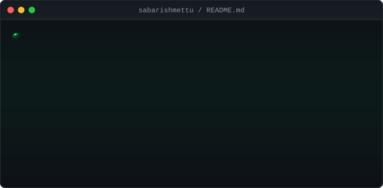

<br/>

## 👤 About Me

<table>
  <tr>
    <td width="65%" valign="top">
      
    </td>
    <td width="35%" align="center" valign="middle">
      
    </td>
  </tr>
</table>

<br/>

---

<table border="0">
  <tr>
    <td width="50%" valign="top">

### 📊 Activity & Stats

[](https://github.com/sabarishmettu)

[](https://github.com/sabarishmettu)

[](https://github.com/sabarishmettu)

    </td>
    <td width="50%" valign="top">

### 🎮 Interests & Favorites

```yaml
Anime & Tech:
  - Cyberpunk & Sci-Fi Aesthetics
  - Embedded Systems & Hardware Hacking
  - Steganography & Network Security
  - Python Automation & Microcontrollers
```

#### 🛠️ Tech Stack & Skills


#### 🏆 GitHub Trophies


    </td>
  </tr>
</table>

<br/>

---

## 🚀 Projects & Details

<details>
  <summary><b>📁 Featured Repositories</b></summary>
  <br/>
  <div align="center">
    <a href="https://github.com/sabarishmettu/Image-Steganography">
      
    </a>
    <a href="https://github.com/sabarishmettu/USB-RUBBER-DUCKY">
      
    </a>
    <a href="https://github.com/sabarishmettu/Flappy-bird-game">
      
    </a>
    <a href="https://github.com/sabarishmettu/AutoTyper">
      
    </a>
  </div>
</details>

<details>
  <summary><b>⚙️ Permissions, Limitations and Conditions</b></summary>
  <br/>

  | Permissions | Limitations | Conditions |
  | :--- | :--- | :--- |
  | ✔ Commercial use | ✖ Liability | ℹ License and copyright notice |
  | ✔ Modification | ✖ Warranty | ℹ State changes |
  | ✔ Distribution | | |
  | ✔ Private use | | |

</details>

<details>
  <summary><b>📜 Licenses Overview</b></summary>
  <br/>

  - **MIT License**: Image-Steganography, Digispark-mouse-mover
  - **Open Source**: Public repositories open for contributions and learning.

</details>

<br/>

---

<div align="center">
  
</div>
