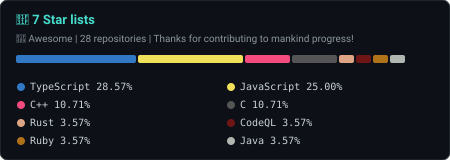

  

 

## 🧑‍💻 About Me

  
  &nbsp;&nbsp;
  

 

  
  &nbsp;
  

 

  
<b>⭐ Favorite Anime &amp; Manhwa Characters (16 Top Heroes)</b>

   
  

    <!--
    -->
    <!--
    -->
    <!--
    -->
    <!--
    -->
    <!--
    -->
    <!--
    -->
    <!--
    -->
    
     
    <!--
    -->
    <!--
    -->
    <!--
    -->
    <!--
    -->
    <!--
    -->
    <!--
    -->
    <!--
    -->
    
  

 

## 🚀 Featured Repositories &amp; Security Projects

| Repository | Language | Description | Stars |
| :--- | :---: | :--- | :---: |
| [**Image-Steganography**](https://github.com/sabarishmettu/Image-Steganography) | `Python` | Encode and decode hidden secret payloads and messages inside digital image pixel matrices using LSB steganography. | ⭐ 3 |
| [**USB-RUBBER-DUCKY**](https://github.com/sabarishmettu/USB-RUBBER-DUCKY) | `C++ / DuckyScript` | Keystroke injection scripts, DuckyScript payloads, BadUSB automation, and hardware penetration testing workflows. | ⭐ 1 |
| [**Mettu_Sabarish_SABER.DEV_Portfolio**](https://github.com/sabarishmettu/Mettu_Sabarish_SABER.DEV_Portfolio) | `TypeScript` | Interactive developer portfolio built with React &amp; TypeScript, deployed live on Vercel. | ⭐ 1 |
| [**Digispark-mouse-mover**](https://github.com/sabarishmettu/Digispark-mouse-mover) | `C++` | Automated USB HID mouse cursor mover and keep-awake jitter firmware for ATtiny85 Digispark boards. | ⭐ 1 |
| [**Flappy-Bird-updated**](https://github.com/sabarishmettu/Flappy-Bird-updated) | `Python` | 2D arcade game featuring custom physics gravity curves, obstacle collision detection, and score mechanics. | ⭐ 1 |
| [**AutoTyper**](https://github.com/sabarishmettu/AutoTyper) | `Python` | Automated keyboard input synthesizer with customizable characters-per-second and natural typing delays. | ⭐ 1 |

 

## 🛠️ Verified Technical Stack &amp; Hardware Toolkit

  
  
  
  
  

  
  
  
  
  
  

  
  
  
  

  🌐 <b>Portfolio:</b> <a href="https://mettusabarish.vercel.app/">mettusabarish.vercel.app</a> &nbsp;•&nbsp; 📍 <b>Bengaluru, India</b> &nbsp;•&nbsp; ✉️ <a href="mailto:mettusabarish96@gmail.com">mettusabarish96@gmail.com</a>

  

  

